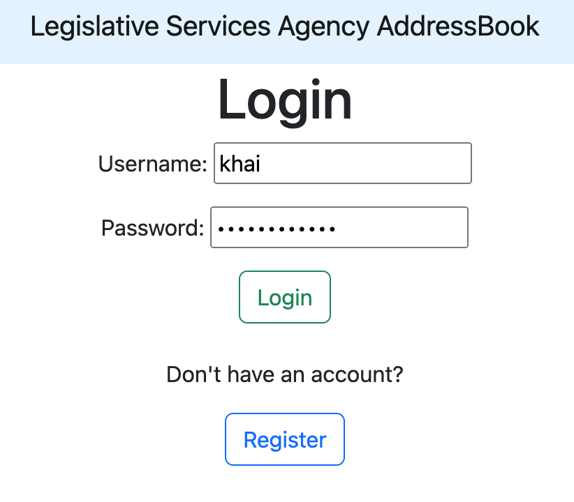
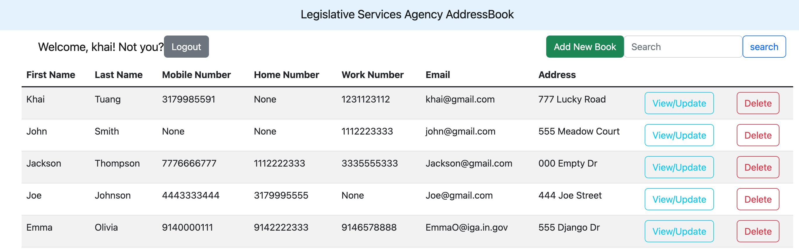
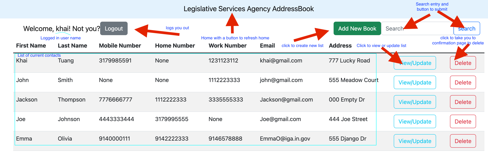

# LSA Address Book Application


## To Run The Project

Clone the Project
```bash
  1. Open VS code Terminal 
  2. cd to a folder of your choosing
  3. run `git clone https://github.com/asapkyxy/Django_LSA_Addressbook.git`
  4. project should get loaded and cloned.
```

Set up virtual env and run
```bash
  1. go the project folder --> run `cd Django_LSA_Addressbook`
  2. run: `python3 -m venv env` create virtual env (or run `sudo pip install virtualenv`)
  3. run: `source env/bin/activate` activate env
  4. you should be be directed to (env) enviroment
  5. run: `pip3 install -r requirements.txt` (or run `python3 install django` to get the latest django)
```
Run the server
```bash
  1. Python3 manage.py runserver
  2. cmd + click server link:  https://127.0.0.1:8000/
```

## Demo The Project
1. Login with username and password (feel use to test Username: `khai` Password: `indianahouse`)
OR click register to create a new account and make a complete new list.


2. Homepage


3. Homepage with all functionalities


4. Update or create new List


5. Are you use you want to delete?


